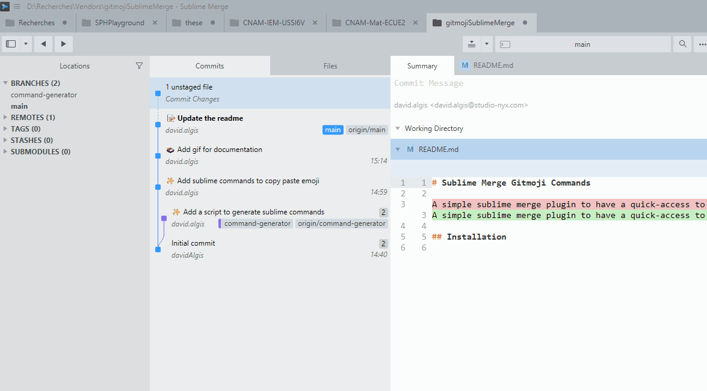

# Sublime Merge Gitmoji Commands

A simple sublime merge plugin to have a quick-access to [https://github.com/carloscuesta/gitmoji](gitmoji) for Sublime Merge commit message.

## Installation

1. Download the file : `Gitmoji.sublime-commands`
2. Copy it into your user package

```
Sublime Merge ▸ Preferences ▸ Browse Packages…
````
Drop the file inside the **`User/`** folder.

## How it works

Hit `Ctrl/⌘ + Shift + P` then write `Gitmoji...` with the name of the gitmoji you're searching for. Press enter it'll add the gitmoji into your clipboard you can just paste it into your message.



Happy committing! 🎉

